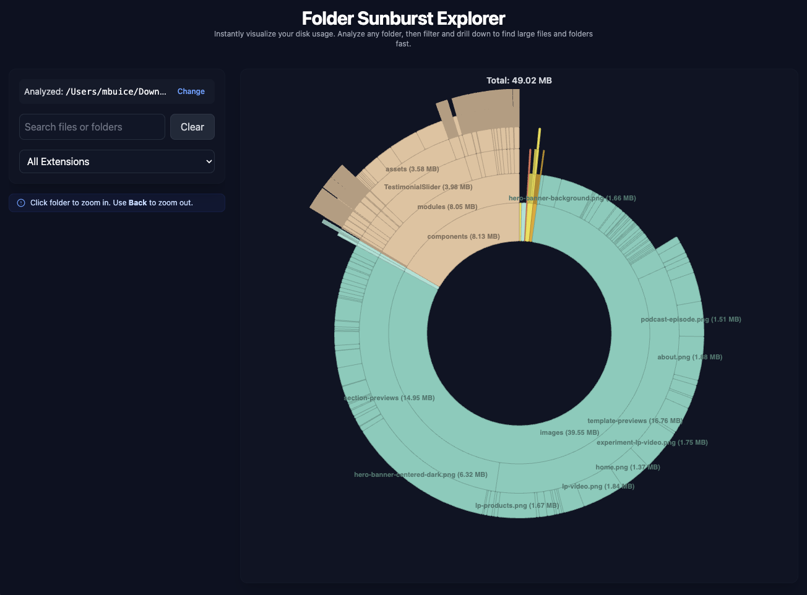
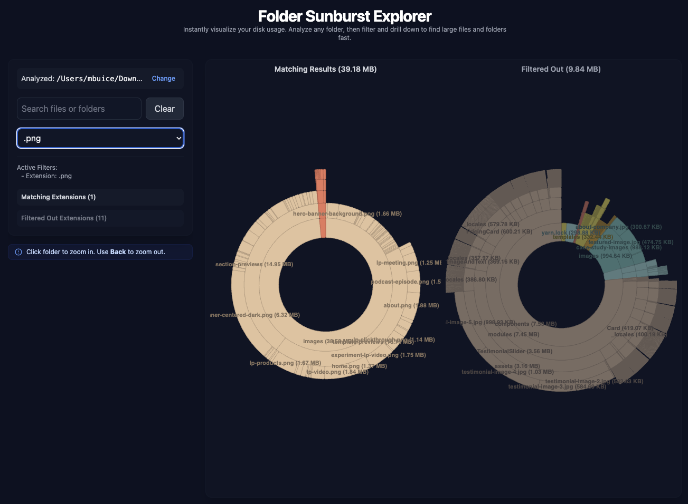

# Folder Sunburst Explorer


**Visualize your folder structure and file sizes as an interactive sunburst chart. Drill down, filter by name or extension, and explore your disk usage visually.**

## Screenshots

**Unfiltered View:**



**Filtered View (Example):**



## Features

- **Interactive Sunburst Chart:** Visualizes folder structure and relative file sizes.
- **Drilldown Navigation:** Click folders to zoom in, use the "Back" button to zoom out.
- **Dynamic Filtering:** Filter the view by file/folder name (substring match) and/or file extension.
- **Dual Chart View:** When filtering, see both the "Matching Results" and "Filtered Out" portions.
- **Informative Tooltips:** Hover over segments for details (name, size, relative path).
- **Clear Arc Labels:** Segment names and calculated sizes displayed on arcs.
- **Extension Breakdown:** See total sizes per extension in filtered/unfiltered views.
- **Responsive UI:** Built with React and Tailwind CSS for modern look and feel.
- **Local File Access:** Uses Node.js APIs executed by the Bun runtime to access the local file system.
- **Error Handling:** Displays errors encountered during file system access (e.g., permission denied).

## Setup

Install dependencies:

```bash
bun install
```

Start the application:

```bash
bun dev
```

## Usage

1.  Run `bun dev` to start the application.
2.  Enter the **absolute path** to the folder you want to analyze in the input box.
3.  Click "Analyze".
4.  Explore the sunburst chart:
    - Hover over arcs to see tooltips.
    - Click a folder segment to zoom in.
    - Use the **Back** button in the control panel to zoom out.
    - Use the filter bar to search by name or select an extension.
    - Use the **Clear** button to remove filters.
    - Use the **Change** button next to the analyzed path to start a new analysis.

## Tech Stack

- **Runtime/Build/Serve:**
  - [Bun](https://bun.sh/) (Runtime, bundler, package manager, script runner, server)
- **Frontend:**
  - [React](https://react.dev/) (UI Library)
  - [TypeScript](https://www.typescriptlang.org/)
  - [Tailwind CSS](https://tailwindcss.com/) (Styling)
  - [Nivo Sunburst](https://nivo.rocks/sunburst/) (Visualization)
- **Backend Logic (File System Access):**
  - Node.js APIs (executed via `server.js` within the Bun runtime)
- **Development:**
  - [ESLint](https://eslint.org/) / [Prettier](https://prettier.io/) (Linting / Formatting)

## Development Scripts

- `bun dev`: Runs the application entry point (`src/index.tsx`) using Bun, which likely handles serving the frontend and running the backend logic.
- `bun build`: Builds the application (see `build.ts` for details).
- `bun run lint`: Lint the codebase.
- `bun run format`: Format the codebase.
- `bun run type-check`: Run TypeScript type checking.
- `bun run test`: Run tests using Jest.

## API Interaction

The frontend communicates with backend logic (likely `server.js` executed by Bun) via standard `fetch` calls to an endpoint like `/api/analyze-folder/:encodedPath`.

Where `:encodedPath` is the URL-encoded absolute path of the folder to analyze.

**Successful Response (Example):**

```json
{
  "message": "Folder analysis complete",
  "tree": {
    "id": "/Users/mbuice/src", // Absolute path used as ID
    "name": "src", // Base name of the folder
    "children": [
      { "id": "/Users/mbuice/src/file1.js", "name": "file1.js", "size": 1024 },
      {
        "id": "/Users/mbuice/src/subdir",
        "name": "subdir",
        "children": [
          { "id": "/Users/mbuice/src/subdir/file2.txt", "name": "file2.txt", "size": 500 }
        ],
        "size": 500 // Directory size reflects sum of contents
      }
    ],
    "size": 1524 // Root size reflects sum of all contents
  },
  "errors": [] // List of non-fatal errors (e.g., permission denied strings)
}
```

**Error Response (Example):**

```json
{
  "message": "Error analyzing folder: directory not found",
  "tree": null,
  "errors": ["directory not found"]
}
```

## Contributing

Contributions are welcome! Please open issues or pull requests for bugs, features, or improvements.

1.  Fork the repo and create a branch.
2.  Run `bun run lint`, `bun run format`, and `bun run type-check` before submitting.
3.  Add/adjust tests for new features if applicable.
